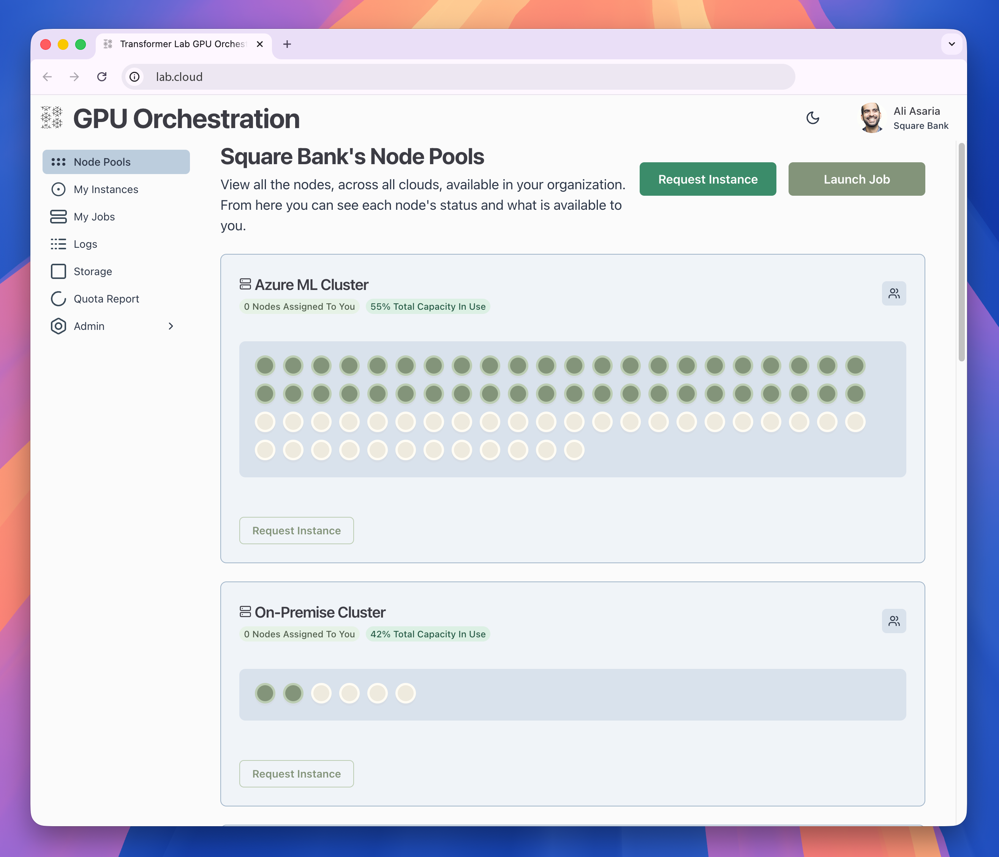
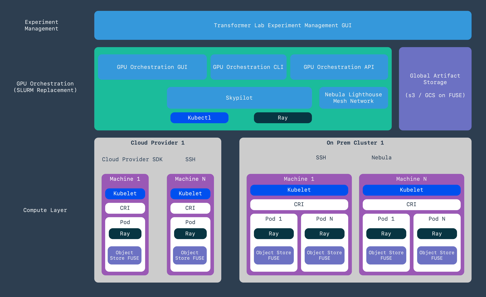

# Transformer Lab GPU Orchestration

[](LICENSE)

<!-- [](https://github.com/your-org/your-repo/actions) -->

> **Warning**  
> This project is under active development and currently has dependencies on WorkOS. Instructions are tailored for our internal team, but we are working to make deployment easy for everyone.  
> **Join our [Discord](https://discord.gg/transformerlab) if you'd like to help!**

Visit us at [http://lab.cloud](http://lab.cloud) for updates.

---



<p align="center">
  
</p>

---

## 🏗️ Architecture

- **Backend**: FastAPI with WorkOS SSO integration, API at `/api/v1/*`
- **Frontend**: React + TypeScript + MUI Joy UI, served from `/`
- **Authentication**: WorkOS SSO with session cookies
- **Unified Deployment**: Single port (`8000`) serves both frontend and backend
- **Development**: Hot reload support; optional separate frontend server

---

## 🚀 Quick Start

### Prerequisites

- Python 3.8+
- Node.js 16+
- uv (can be installed via `curl -LsSf https://astral.sh/uv/install.sh | sh`)
- WorkOS account and application setup

### Setup Instructions

1. **WorkOS Setup**: Create a WorkOS account at [workos.com](https://workos.com) and configure your SSO connection.
2. **Configure Environment**: Copy `.env.example` to `.env` and add your WorkOS credentials.
3. **Run Setup Script**:
   ```bash
   ./setup.sh
   ```
   (Installs all dependencies and runs database migrations.)

You are set up!

---

## 🔑 WorkOS Configuration

1. Create a WorkOS account at [workos.com](https://workos.com)
2. Create a new WorkOS application
3. Configure your SSO connection (Google, Microsoft, etc.)
4. Note your API Key and Client ID
5. Add redirect URI:
   ```
   http://localhost:8000/api/v1/auth/callback
   ```

---

## 🛠️ Run in Development

1. Ensure your env files are set in `/backend/.env` and `/frontend/.env`.  
   For frontend dev, set:
   ```
   VITE_API_URL=http://localhost:8000/api/v1
   ```
   (Use `VITE_API_URL=/api/v1` only for production with unified server.)
2. Run backend and migrations:
   ```
   ./start.sh --dev
   ```
3. In another window, run frontend:
   ```
   npm run dev
   ```

---

## 🗄️ Database Migrations (Alembic)

This project uses Alembic with SQLAlchemy for schema changes.  
Migrations live in `backend/alembic/versions` and target metadata from `backend/config.py`.

### Typical Workflow

1. Make model changes in `backend/db_models.py`.
2. Create a migration (autogenerate):
   ```bash
   cd backend
   source .venv/bin/activate
   alembic revision --autogenerate -m "describe your change"
   ```
3. Apply migrations (automatically runs with `start.sh`):
   ```bash
   alembic upgrade head
   ```
4. Verify/history (optional):
   ```bash
   alembic current
   alembic history --verbose
   ```

---

## 🐳 Docker Deployment

### Method 1: Using `docker-run.sh` (Recommended)

1. **Create environment file**:  
   Copy `.env.example` to `.env` and configure:
   ```env
   AUTH_API_KEY=your_api_key_here
   AUTH_CLIENT_ID=your_client_id_here
   AUTH_REDIRECT_URI=http://localhost:8000/api/v1/auth/callback
   AUTH_COOKIE_PASSWORD=your_secure_cookie_password
   BASE_URL=http://localhost:8000
   ```
2. Run:
   ```bash
   ./docker-run.sh build-and-run
   ```

---

## 🔐 API Key Scopes

| Scope              | Description                                     |
| ------------------ | ----------------------------------------------- |
| `admin`            | Full access to all write operations             |
| `compute:write`    | Launch, stop, and manage compute jobs/instances |
| `nodepools:write`  | Create, update, or delete node pools            |
| `storage:write`    | Create, mount, or modify storage buckets        |
| `registries:write` | Manage private container registries             |

- Scopes apply to API key-authenticated requests. Session-authenticated users are not scope-restricted.
- If an API key has no scopes, it cannot perform protected write actions.
- Selecting the `admin` scope supersedes all others.
- The server exposes allowed scopes at `GET /api/v1/auth/allowed-scopes`.
- Scope values are case-insensitive on input; they are normalized to lowercase and `admin` is exclusive (cannot be combined).

---

## 🧪 Tests

- **Framework:** `pytest`
- **Location:** `tests/`

Quick run:

```bash
./run_tests.sh
```

### Run tests (uv)

1. Create/activate venv (if not already):
   ```bash
   uv venv --python 3.10
   source .venv/bin/activate
   ```
2. Install dev deps (includes pytest):
   ```bash
   uv pip install -e .[dev]
   ```
3. Run tests:
   ```bash
   pytest
   ```

Tips:

- Run a single file: `pytest tests/test_app_basic.py`
- Run a single test: `pytest -k login_url`
- Forward args via script: `./run_tests.sh -k login_url`

Notes:

- Tests isolate `$HOME` to `tests/.tmp_home` and set `DATABASE_URL` to a file-based SQLite DB under that folder; Alembic migrations run at test session start to match production schema.
- The initial tests are intentionally simple to serve as templates for future tests.
